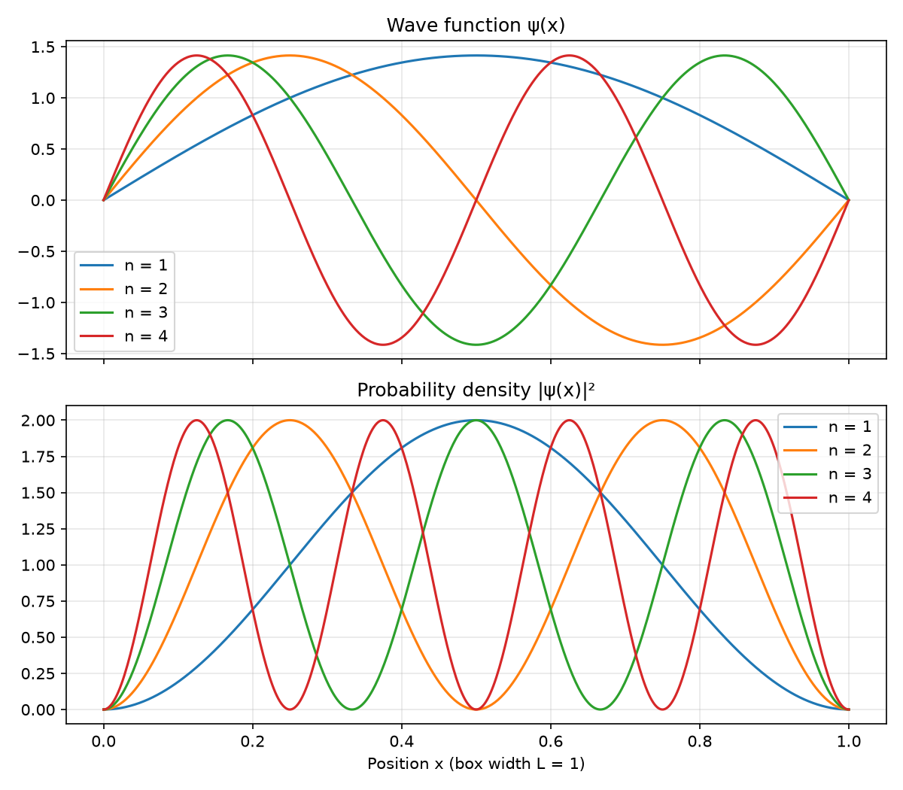

# Particle in a Box

A Python simulation of a quantum particle trapped in a 1D box.
It plots the wave function ψ(x) and the probability density |ψ(x)|²
for the first four energy levels.

## Run it
pip install numpy matplotlib
python particle_in_box.py
